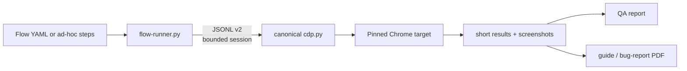

# teibto-browser-qa

[](https://github.com/Teibto/teibto-browser-qa/releases/latest)
[](https://github.com/Teibto/teibto-browser-qa/actions/workflows/ci.yml)
[-orange?logo=googlechrome)](https://github.com/Teibto/teibto-dev-standards)
[](LICENSE)

<p align="center">
  
</p>

A browser-QA skill for driving a real Chrome target through the team's canonical `cdp.py`. It turns
one live flow into an evidence-backed verdict and, when needed, a user guide or bug report.

> **Renamed 2026-08-21:** `agent-browser-qa` moved to `Teibto/teibto-browser-qa`. Install only
> `teibto-browser-qa`; remove the old skill directory after updating callers so the same capability is
> not discovered twice.

## What it provides

- Trusted click/fill/key actions through Chrome DevTools Protocol, with no JavaScript-click fallback.
- Short, bounded assertions and filtered accessibility output instead of whole-page dumps.
- Console, screenshot, visual-diff, responsive, theme, keyboard-focus, network, a11y, and performance
  evidence as opt-in layers.
- A strict YAML runner that pins one target and uses one bounded CDP JSONL protocol-v2 session per run.
- Per-phase telemetry that separates driver work from application waits.
- HTML/PDF templates for user guides and bug reports generated from the same evidence run.

The skill is for live acceptance, exploratory, regression, and documentation work. It does not write
or operate Playwright/Cypress CI suites. NetSuite record forms use `netsuite-ui-qa-testing`; QA
plans, evidence packs, and release-readiness review use `teibto-qa-review`.



## Install

Download `teibto-browser-qa.skill` from the
[latest release](https://github.com/Teibto/teibto-browser-qa/releases/latest), or clone this repository
into the skill directory used by your agent runtime.

Install runtime dependencies:

```bash
py -m pip install -r requirements.txt
py -m pip install websocket-client pillow numpy
```

The flow runner requires canonical `cdp.py` JSONL protocol v2 or newer, first released in
[`teibto-dev-standards v0.82.0`](https://github.com/Teibto/teibto-dev-standards/releases/tag/v0.82.0).
Pass its path with `--cdp-script` or `TEIBTO_CDP_SCRIPT`. The runner also checks the standard team
installation path automatically. CI verifies every change against that pinned tag in real Chrome
(`driver-compat` job; see [`CONTRIBUTING.md`](CONTRIBUTING.md)).

## Quick smoke run

Launch a dedicated Chrome profile and port, pin a target, navigate with event-bound readiness, then
assert the page and capture evidence:

```bash
export TEIBTO_CDP_SCRIPT="$HOME/.claude/skills/netsuite-qa-browser/references/cdp.py"
export CDP_PORT=9400
AB(){ py "$TEIBTO_CDP_SCRIPT" "$@"; }

chrome --user-data-dir=/tmp/teibto-browser-qa-profile \
  --remote-debugging-port=$CDP_PORT --no-first-run about:blank &
until curl -sf "http://127.0.0.1:$CDP_PORT/json/version" >/dev/null; do sleep 1; done

export TGT_ID=$(AB newtab "https://example.com?job=smoke")
AB nav https://example.com --until=load --timeout=30
AB get text title
AB console
AB shot hello.png
```

The title should contain `Example Domain`, `console` should return `[]`, and `hello.png` should exist.
If `console` reports that no collector exists, the page was not observed; that is not a clean result.
See [`references/commands.md`](references/commands.md) for the complete command reference and
[`references/gotchas.md`](references/gotchas.md) before testing a live application.

## Run a repeatable flow

[`examples/saucedemo.yaml`](examples/saucedemo.yaml) demonstrates a happy path plus an adversarial
scenario. Pin the target and send secrets through stdin rather than argv:

```powershell
$env:TGT_ID = '<page-target-id>'
$env:TEIBTO_CDP_SCRIPT = 'D:\path\to\teibto-dev-standards\scripts\cdp.py'
'{"username":"standard_user","password":"..."}' |
  py scripts/flow-runner.py --flow examples/saucedemo.yaml --out runs/manual --vars-json - `
    --stdout summary
```

The runner writes:

```text
runs/manual/
  run-log.jsonl
  qa-report.md
  shots/
```

It validates the schema before opening the driver, refuses to guess a shared tab, negotiates protocol
v2+, waits for the new main-frame document on navigation, polls bounded observable outcomes after fast
inputs, redacts secret variables, records every auto-answered dialog as evidence under a pinned
`safe` dialog policy, and fails closed on command, wait, assertion, capture, console, or transport
errors. An unasserted state-changing action is `UNVERIFIED`, never `PASS`.

`--stdout summary` returns only the terminal result while the full event stream remains in
`run-log.jsonl`. A step may set `perf_budget_ms` to fail when action + explicit outcome wait +
assertion exceeds its budget; screenshot and session startup are excluded from that clock.

For the exact YAML, wait, capture, and telemetry contracts, read
[`references/flow-spec.md`](references/flow-spec.md).

## Optional local UI

The local UI is a thin wrapper around the same runner:

```bash
node app/server.js
```

Open `http://127.0.0.1:4173` and provide a pinned target. The server binds to loopback, sends secrets
to the runner through stdin, streams events, and supports cancellation. It is not a browser daemon and
does not own Chrome state.

## Documentation map

Read only the reference needed for the current task:

| Need | Source |
|---|---|
| Safety traps and diagnosis | [`references/gotchas.md`](references/gotchas.md) |
| CDP commands and setup | [`references/commands.md`](references/commands.md) |
| Test design and browser limits | [`references/test-design.md`](references/test-design.md), [`references/cdp-limits.md`](references/cdp-limits.md) |
| Flow schema, waits, capture, telemetry | [`references/flow-spec.md`](references/flow-spec.md) |
| Retry, quarantine, and coverage gate | [`references/reliability-policy.md`](references/reliability-policy.md), [`references/coverage-model.md`](references/coverage-model.md) |
| Visual, a11y, performance, and UX layers | [`references/visual-regression.md`](references/visual-regression.md), [`references/a11y-layer.md`](references/a11y-layer.md), [`references/perf-layer.md`](references/perf-layer.md), [`references/ux-lens.md`](references/ux-lens.md) |
| PDF output | [`references/pdf-reports.md`](references/pdf-reports.md) |
| Explicit UI configuration | [`references/configure.md`](references/configure.md) |
| Architecture and verified claims | [`docs/ARCHITECTURE.md`](docs/ARCHITECTURE.md), [`docs/CLAIMS-AUDIT.md`](docs/CLAIMS-AUDIT.md) |
| Contribution and release workflow | [`CLAUDE.md`](CLAUDE.md), [`CONTRIBUTING.md`](CONTRIBUTING.md) |

## Maintainer checks

```bash
python -m unittest discover -s tests -v
python scripts/validate-skill.py
node --check app/server.js
bash tests/test-flow-runner-live.sh
bash self-test/smoke-test.sh
python scripts/build-skill.py
```

The `.skill` file is a generated release artifact and is not committed. Behavioral claims are tracked
in [`docs/CLAIMS-AUDIT.md`](docs/CLAIMS-AUDIT.md); release steps are in
[`CONTRIBUTING.md`](CONTRIBUTING.md).

## License

[MIT](LICENSE) © 2026 Wichit Wongta.
