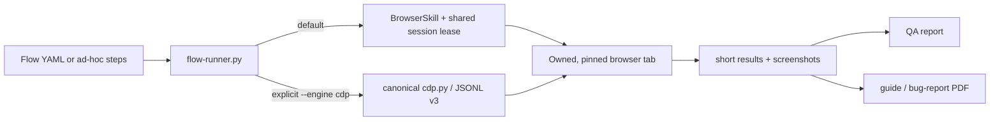

# teibto-browser-qa

[](https://github.com/Teibto/teibto-browser-qa/releases/latest)
[](https://github.com/Teibto/teibto-browser-qa/actions/workflows/ci.yml)
[-orange?logo=googlechrome)](https://github.com/Teibto/teibto-dev-standards)
[](LICENSE)

<p align="center">
  
</p>

A browser-QA skill for driving Chrome through BrowserSkill (`bsk`) by default, using the user's existing login. It turns
one live flow into an evidence-backed verdict and, when needed, a user guide or bug report.

> **Renamed 2026-08-21:** `agent-browser-qa` moved to `Teibto/teibto-browser-qa`. Install only
> `teibto-browser-qa`; remove the old skill directory after updating callers so the same capability is
> not discovered twice.

## What it provides

- Trusted click/fill/key actions through Chrome DevTools Protocol, with no JavaScript-click fallback.
- Short, bounded assertions and filtered accessibility output instead of whole-page dumps.
- Console, screenshot, visual-diff, responsive, theme, keyboard-focus, network, a11y, and performance
  evidence as opt-in layers.
- A strict YAML runner that pins one target and uses one bounded CDP JSONL protocol-v3 session per run.
- Per-phase telemetry that separates driver work from application waits.
- HTML/PDF templates for user guides and bug reports generated from the same evidence run.

The skill is for live acceptance, exploratory, regression, and documentation work. It does not write
or operate Playwright/Cypress CI suites. NetSuite record forms use `netsuite-ui-qa-testing`; QA
plans, evidence packs, and release-readiness review use `teibto-qa-review`.



## Install

Download `teibto-browser-qa.skill` from the
[latest release](https://github.com/Teibto/teibto-browser-qa/releases/latest), or clone this repository
into the skill directory used by your agent runtime.

Install runtime dependencies:

```bash
py -m pip install -r requirements.txt
py -m pip install websocket-client pillow numpy
```

The explicit `--engine cdp` lane requires canonical `cdp.py` JSONL protocol v3 or newer, first released in
[`teibto-dev-standards v0.83.0`](https://github.com/Teibto/teibto-dev-standards/releases/tag/v0.83.0).
Pass its path with `--cdp-script` or `TEIBTO_CDP_SCRIPT`. The runner also checks the standard team
installation path automatically. CI verifies every change against that pinned tag in real Chrome
(`driver-compat` job; see [`CONTRIBUTING.md`](CONTRIBUTING.md)).

## Quick smoke run

Install the pinned BrowserSkill CLI and connect its extension to the host-managed daemon.
Read [`references/engine2-bsk.md`](references/engine2-bsk.md) for setup, shared-session rules,
dialog handling and NetSuite identity checks. The same engine is the default for NetSuite interactive QA
when selected by the machine owner.

```powershell
$env:BSK_AUTO_START = '0'
python scripts/bsk-shared.py status
$sid = python scripts/bsk-shared.py ensure
python scripts/flow-runner.py --flow examples/saucedemo.yaml --out runs/manual `
  --engine bsk --bsk-session $sid --stdout summary
```

Choose `--browser <instance-id>` on the coordinator when multiple browsers are connected.
The runner owns its tab and holds the session lease; do not stop the shared session after a run.
Use `--engine cdp` only for the capabilities listed in the engine reference or CI.

For fixes newer than the latest `.skill` release, use a verified `main` commit, run
`python scripts/build-skill.py`, and install the complete bundle into each agent's skill directory.
Record the source commit and preserve local configuration separately; old skill descriptions can
otherwise continue routing agents to CDP even after the runner has been updated.

## Run a repeatable flow

[`examples/saucedemo.yaml`](examples/saucedemo.yaml) demonstrates a happy path plus an adversarial
scenario. Share a session and send secrets through stdin rather than argv:

```powershell
$env:BSK_AUTO_START = '0'
$sid = python scripts/bsk-shared.py ensure
'{"username":"standard_user","password":"..."}' |
  py scripts/flow-runner.py --flow examples/saucedemo.yaml --out runs/manual --vars-json - `
    --engine bsk --bsk-session $sid --stdout summary
```

The runner writes:

```text
runs/manual/
  run-log.jsonl
  qa-report.md
  shots/
```

It validates the schema before opening the driver, owns and pins its tab, attributes structured dialog evidence to the command/step that caused it, waits for the new
main-frame document on navigation, and polls bounded observable outcomes after fast
inputs, redacts secret variables, records every auto-answered dialog as evidence under a pinned
`safe` dialog policy, and fails closed on command, wait, assertion, capture, console, or transport
errors. An unasserted state-changing action is `UNVERIFIED`, never `PASS`.

`--stdout summary` returns only the terminal result while the full event stream remains in
`run-log.jsonl`. A step may set `perf_budget_ms` to fail when action + explicit outcome wait +
assertion exceeds its budget; screenshot and session startup are excluded from that clock.

For the exact YAML, wait, capture, and telemetry contracts, read
[`references/flow-spec.md`](references/flow-spec.md).

## Optional local UI

The local UI is a thin wrapper around the same runner:

```bash
node app/server.js
```

Open `http://127.0.0.1:4173` and provide a pinned target. The server binds to loopback, sends secrets
to the runner through stdin, streams events, and supports cancellation. It is not a browser daemon and
does not own Chrome state.

## Documentation map

Read only the reference needed for the current task:

| Need | Source |
|---|---|
| Safety traps and diagnosis | [`references/gotchas.md`](references/gotchas.md) |
| Explicit CDP commands and setup | [`references/commands.md`](references/commands.md) |
| Test design and browser limits | [`references/test-design.md`](references/test-design.md), [`references/cdp-limits.md`](references/cdp-limits.md) |
| Flow schema, waits, capture, telemetry | [`references/flow-spec.md`](references/flow-spec.md) |
| Retry, quarantine, and coverage gate | [`references/reliability-policy.md`](references/reliability-policy.md), [`references/coverage-model.md`](references/coverage-model.md) |
| Visual, a11y, performance, and UX layers | [`references/visual-regression.md`](references/visual-regression.md), [`references/a11y-layer.md`](references/a11y-layer.md), [`references/perf-layer.md`](references/perf-layer.md), [`references/ux-lens.md`](references/ux-lens.md) |
| PDF output | [`references/pdf-reports.md`](references/pdf-reports.md) |
| Explicit UI configuration | [`references/configure.md`](references/configure.md) |
| Architecture and verified claims | [`docs/ARCHITECTURE.md`](docs/ARCHITECTURE.md), [`docs/CLAIMS-AUDIT.md`](docs/CLAIMS-AUDIT.md) |
| Contribution and release workflow | [`CLAUDE.md`](CLAUDE.md), [`CONTRIBUTING.md`](CONTRIBUTING.md) |

## Maintainer checks

```bash
python -m unittest discover -s tests -v
python scripts/validate-skill.py
node --check app/server.js
bash tests/test-flow-runner-live.sh
bash self-test/smoke-test.sh
python scripts/build-skill.py
```

The `.skill` file is a generated release artifact and is not committed. Behavioral claims are tracked
in [`docs/CLAIMS-AUDIT.md`](docs/CLAIMS-AUDIT.md); release steps are in
[`CONTRIBUTING.md`](CONTRIBUTING.md).

## License

[MIT](LICENSE) © 2026 Wichit Wongta.
