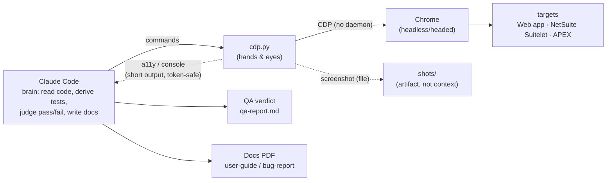

# agent-browser-qa

[](https://github.com/wichtking/agent-browser-qa/releases/latest)
[](https://docs.anthropic.com/claude/docs/skills)
[-orange?logo=googlechrome)](https://github.com/Teibto/teibto-dev-standards)
[](LICENSE)

<p align="center">
  
</p>

A Claude Code skill for browser QA and documentation. Drive a real browser through a flow once and get two things back: a QA verdict, and a polished user guide or bug report.

> **Transport note (2026-08-02):** this skill used to drive Chrome through the `agent-browser` CLI and its background daemon. It now talks **straight to Chrome over CDP** via `cdp.py` — the team's shared driver in [`Teibto/teibto-dev-standards`](https://github.com/Teibto/teibto-dev-standards). The daemon was dropped because it hung without saying why (`os error 10060` loops, silently dead Chrome) and could not answer JavaScript dialogs at all — `beforeunload` wedged it permanently. The repo keeps its name for continuity. Command-by-command mapping: [`references/commands.md`](references/commands.md).

The reference files under [`references/`](references) are working notes kept in Thai. This README and [`SKILL.md`](SKILL.md) are in English.

**New here?** Read in order: this README → [`SKILL.md`](SKILL.md) (golden rules + workflow) → [`docs/ARCHITECTURE.md`](docs/ARCHITECTURE.md) (diagrams) → [`references/gotchas.md`](references/gotchas.md) (the silent-failure traps). Working *on* the skill? Start with [`CLAUDE.md`](CLAUDE.md) then [`CONTRIBUTING.md`](CONTRIBUTING.md).

## How it works

Claude reads the code, derives the tests, and judges pass or fail. `cdp.py` does the driving and captures the evidence — no daemon in between. Its output never enters the model's context on its own, so a full pass stays cheap; favor short-output commands to keep it that way.



Full diagrams for every flow are in [`docs/ARCHITECTURE.md`](./docs/ARCHITECTURE.md).

## Flows

| Flow | Steps | Output |
|---|---|---|
| Smoke QA | `open` → `wait --load networkidle` → walk happy path → `errors` empty | pass / fail |
| Functional QA | action → `scrollintoview` → `click` → assert state | verdict per step |
| Visual regression | `screenshot` → `diff screenshot --baseline` | `diff.png` |
| Error surfacing | after every key step → `errors --json` + `console --json` | errors surface, not silent |
| User-guide PDF | walk flow, highlight, screenshot → `guide-template.html` → `pdf` | guide PDF (cover, TOC, page numbers) |
| Bug-report PDF | repro, evidence, severity → `bug-report-template.html` → `pdf` | bug PDF (Steps/Expected/Actual) |

Golden rule: `click` does not auto-scroll, so call `scrollintoview` first; and don't trust `✓ Done`, always assert the resulting state. Details in [`references/gotchas.md`](references/gotchas.md).

## Features

- **One pass, two outputs.** A single run gives you the QA verdict and the docs together, so nothing needs a second walkthrough.
- **Real pages, not mocks.** It drives actual Chrome over CDP against any web app, including NetSuite Suitelets and Oracle APEX, headless or headed.
- **Deliberate test design.** A Phase 0–3 method turns code and acceptance criteria into a coverage matrix, and states up front which cases a browser can verify and which must come from a code review.
- **Four QA layers.** Smoke, functional, visual regression, and error surfacing.
- **Guards against silent failures.** The traps that let automation pass when it shouldn't (below-fold clicks, a fake `✓ Done`, `os 10060`) are written up with reproductions and fixes.
- **Token-aware.** Assertions are short commands and screenshots are saved to files, so testing a large app doesn't fill the context window.
- **Reproducible specs.** Test cases live as YAML with `requirement` and `acceptance` fields, so a requirement, its test, and its guide share one id.
- **Documents that ship.** User guides and bug reports export to PDF with a cover, table of contents, page numbers, and highlighted screenshots.
- **Records runs.** Capture a flow as video, watch it live, or add a pointer ring so the recording shows where each action lands.
- **Fits a team.** A lifecycle playbook, a release gate, and a RACI table live in [`docs/TEAM-PROCESS.md`](docs/TEAM-PROCESS.md).

## Gotchas it protects against

| Trap | Symptom | Fix |
|---|---|---|
| `click` below the fold (≤0.27) | `✓ Done` but no-op — **fixed on 0.3x, which auto-scrolls** | `scrollintoview <sel>` before `click` — now a safe habit, still needed on old/mixed versions |
| Don't trust `✓ Done` | command succeeds but has no effect | assert state after every action (`wait` / `get url` / `get text`) |
| `os error 10060` | `wait --text` / `wait <selector>` flakes on Windows | use `wait --load networkidle` + short state checks (NetSuite: `wait --fn "jQuery.active===0"` — networkidle never settles there) |
| headless has no Thai font | injected Thai labels render as boxes | put Thai text in the HTML, bake only the ring into the image |
| `pdf` double-pagination | paged.js PDF gets alternating blank pages | fit `@page size` + `.pagedjs_page` margin on screen only |

Full detail with evidence: [`references/gotchas.md`](references/gotchas.md).

## Install

Option A, one file: download `agent-browser-qa.skill` from the [Releases](https://github.com/wichtking/agent-browser-qa/releases) page and install it through the Claude Code skill installer.

Option B, clone into your skills directory:
```bash
git clone https://github.com/wichtking/agent-browser-qa.git ~/.claude/skills/agent-browser-qa
```

Then install the driver's dependencies:
```bash
py -m pip install websocket-client pillow numpy   # pillow/numpy only for visual diff
```

`cdp.py` ships with the team skills (`~/.claude/skills/netsuite-qa-browser/references/cdp.py`); point `NS_CDP` elsewhere if you vendor it into a project. Requirements: Chrome, Python 3.10+, and `git` only if you build the `.skill` bundle. Full setup and every command: [`references/commands.md`](references/commands.md).

Maintainers: the `.skill` bundle is a build artifact and is not committed. Rebuild it with `python scripts/build-skill.py` and attach the output to a GitHub Release.

## Quick start

Confirm your setup with a short smoke run: open a page, assert, check for errors, screenshot.

```bash
NS_CDP="$HOME/.claude/skills/netsuite-qa-browser/references/cdp.py"
export CDP_PORT=9400
AB(){ py "$NS_CDP" "$@"; }

chrome --user-data-dir=/tmp/qa-profile --remote-debugging-port=$CDP_PORT --no-first-run about:blank &
until curl -sf "http://127.0.0.1:$CDP_PORT/json/version" >/dev/null; do sleep 1; done

AB nav https://example.com 2
AB get text title          # -> Example Domain
AB console                 # -> []   (empty = no page errors so far)
AB shot hello.png          # evidence file: the image, not context
```

Expect the title to contain `Example Domain` and `console` to print `[]`. If `console` **errors** instead of printing `[]`, the page was not opened with `nav`, so nothing is watching — that distinction is deliberate (see [`references/gotchas.md`](references/gotchas.md) #2).

The first run is slow: a cold browser session can take one to two minutes to start on Windows, and may look like it hung when it hasn't. Keep the session warm and reuse it. If commands keep failing with `os error 10060`, clear the stale session file (see [`references/gotchas.md`](references/gotchas.md), section 3).

For a real multi-step flow, see [`examples/saucedemo.yaml`](examples/saucedemo.yaml) and [`references/flow-spec.md`](references/flow-spec.md).

## Project structure

```
agent-browser-qa/
├── README.md                      this file
├── SKILL.md                       overview, golden rules, workflow
├── CLAUDE.md                      orientation for an agent/dev working on the repo
├── CONTRIBUTING.md                the development loop + how to cut a release
├── docs/
│   ├── ARCHITECTURE.md            workflow diagrams (mermaid) for every flow
│   └── TEAM-PROCESS.md            team playbook: lifecycle, release gate, RACI
├── references/                    working notes (Thai)
│   ├── gotchas.md                 silent-failure traps and fixes
│   ├── test-design.md             what to test (adversarial coverage, Phase 0-3)
│   ├── commands.md                command reference, token discipline, batch
│   ├── flow-spec.md               test cases as repeatable flow YAML
│   └── pdf-reports.md             paged.js recipe (TOC, page numbers, fixes)
├── assets/
│   ├── guide-template.html        user-guide PDF (edit the data array)
│   ├── bug-report-template.html   bug-report PDF (edit the bugs array)
│   ├── highlight.js               inject a highlight ring before screenshot
│   └── pointer.js                 place a pointer ring for video/live
├── examples/
│   └── saucedemo.yaml             runnable flow (happy path + adversarial)
├── qa/
│   └── _template/coverage.yaml    coverage manifest starter (release gate)
├── self-test/                     mechanical claim checks (drift detector)
│   ├── smoke-test.sh              syntax/recipe/reproducible claims + efficiency gates
│   └── pdf/pdf-test.sh            PDF pagination A/B
└── scripts/
    ├── build-skill.py             build the installable .skill bundle
    ├── coverage-check.py          release gate as an exit code
    └── release-summary.py         roll every coverage.yaml into one sign-off table
```

## Scripts

Python tooling (`pip install -r requirements.txt`, PyYAML):

| Script | What it does | Usage |
|---|---|---|
| `scripts/build-skill.py` | Bundle the skill into `agent-browser-qa.skill` (a git-ignored build artifact attached to Releases). | `python scripts/build-skill.py` |
| `scripts/coverage-check.py` | Release gate → exit code: reads a `qa/<feature>/coverage.yaml`, returns 0 pass / 1 fail / 2 malformed. | `python scripts/coverage-check.py qa/<feature>/coverage.yaml` |
| `scripts/release-summary.py` | Roll every `qa/*/coverage.yaml` into one QA-Lead sign-off table. | `python scripts/release-summary.py [qa_dir]` |

Mechanical checks live in [`self-test/`](self-test) — run `bash self-test/smoke-test.sh` after any Chrome or `cdp.py` version bump (30 checks against a real browser). Details in [`CONTRIBUTING.md`](CONTRIBUTING.md).

## Glossary

| Term | Meaning |
|---|---|
| **One pass, two outputs** | A single walk of the happy path yields both a QA verdict and documentation material. |
| **QA layers (1–6)** | Smoke · Functional · Visual regression · Error surfacing · a11y · Perf — each opt-in per scenario. |
| **Flow YAML** | A test case stored as a repeatable file (`requirement` + `acceptance` + scenarios). See [`references/flow-spec.md`](references/flow-spec.md). |
| **Coverage manifest / gate** | `qa/<feature>/coverage.yaml` maps each Acceptance Criterion to the scenario that proves it; `coverage-check.py` turns it into a pass/fail exit code. |
| **Claims audit** | The ledger in [`docs/CLAIMS-AUDIT.md`](docs/CLAIMS-AUDIT.md) recording which claim is measured / verified / inferred / version-pinned. |
| **Golden rules** | The four silent-failure guards in `SKILL.md` §2 (scroll before click, don't trust `✓ Done`, avoid long-poll `wait`, black window ≠ GPU). |

## More docs

- [`CLAUDE.md`](./CLAUDE.md) — orientation for an agent/dev working on the repo (mental model, file map)
- [`CONTRIBUTING.md`](./CONTRIBUTING.md) — the development loop, self-test, and how to cut a release
- [`docs/ARCHITECTURE.md`](./docs/ARCHITECTURE.md) — architecture and workflow diagrams for every flow
- [`docs/TEAM-PROCESS.md`](./docs/TEAM-PROCESS.md) — team playbook: lifecycle, release gate, RACI, artifacts
- [`references/gotchas.md`](./references/gotchas.md) — traps and fixes
- [`references/test-design.md`](./references/test-design.md) — what to test (adversarial coverage)
- [`references/commands.md`](./references/commands.md) — command reference and batch
- [`references/flow-spec.md`](./references/flow-spec.md) — test cases as repeatable flow YAML
- [`references/pdf-reports.md`](./references/pdf-reports.md) — how to make PDFs (paged.js)

## Credits

This skill is a playbook around an upstream tool; it does not reproduce or replace the CLI.

- [vercel-labs/agent-browser](https://github.com/vercel-labs/agent-browser) — the Rust CLI this skill was originally built on, and where the repo name comes from. No longer a dependency (see the transport note at the top); credit and license for the CLI belong to the upstream authors.
- [`Teibto/teibto-dev-standards`](https://github.com/Teibto/teibto-dev-standards) — home of `cdp.py`, the shared CDP driver this skill now drives Chrome with.
- [saucedemo.com](https://www.saucedemo.com) — the Sauce Labs demo app used for examples and evidence runs.
- [Paged.js](https://pagedjs.org/) — PDF pagination.

## License

[MIT](LICENSE) © 2026 Wichit Wongta.
