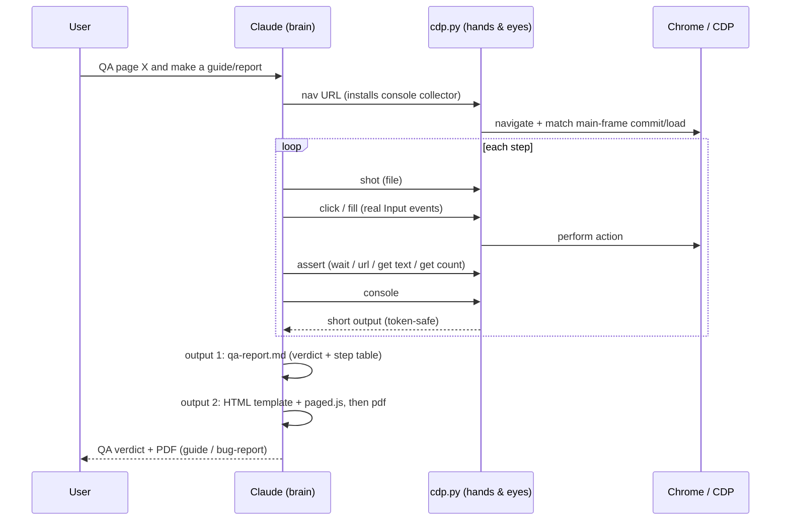
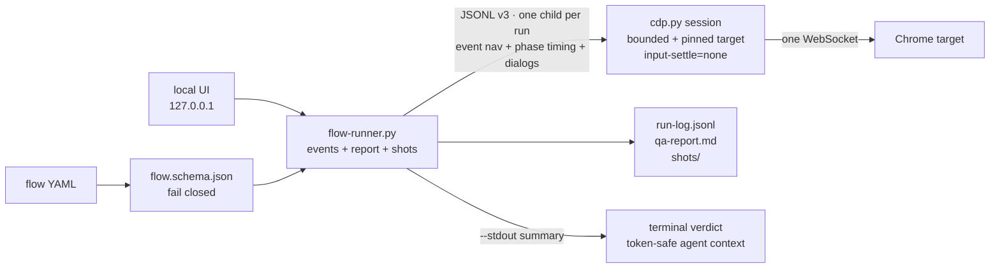
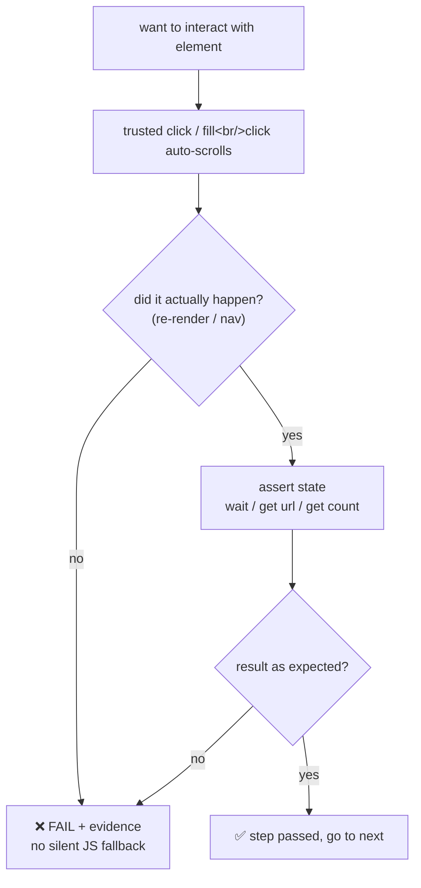
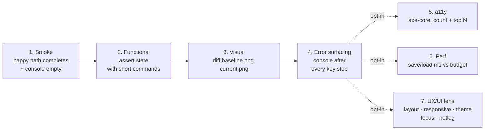
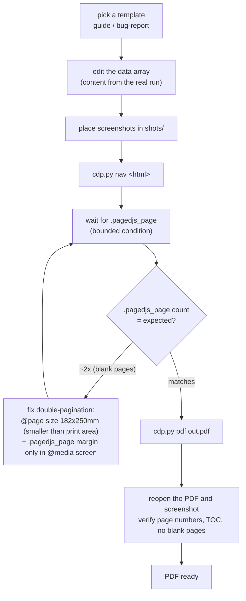
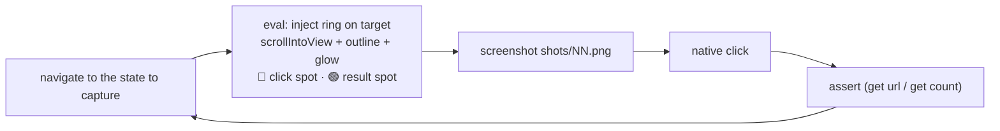

# Architecture

Workflow diagrams for every flow. GitHub renders mermaid natively. A short summary is in
[`../README.md`](../README.md); traps and fixes are in [`../references/gotchas.md`](../references/gotchas.md).

## Contents
1. [Overview: one pass, two outputs](#1-overview-one-pass-two-outputs)
2. [Batch runner boundary](#2-batch-runner-boundary)
3. [Golden-rule action loop](#3-golden-rule-action-loop)
4. [Seven QA layers](#4-seven-qa-layers)
5. [PDF pipeline (paged.js)](#5-pdf-pipeline-pagedjs)
6. [Highlight capture sub-flow](#6-highlight-capture-sub-flow)
7. [Targets and setup](#7-targets-and-setup)

---

## 1. Overview: one pass, two outputs

Walk the happy path once, then split it into two outputs: a QA verdict and documentation material.
Claude is the brain and `cdp.py` is the hands and eyes, talking **straight to Chrome over CDP** —
no daemon in between. Use short-output commands to avoid context overflow.

---

## 2. Batch runner boundary

The optional local UI and the CLI share one executor. A run never opens a driver process per step:

Secrets enter the runner through stdin, not argv. Fixed input sleeps are removed only in this
bounded runner contract; observable application latency is paid in explicit waits and reported
separately from action/assert/capture driver time. An action, wait, screenshot, console check, or
transport failure stops the scenario. Unasserted state-changing actions produce `UNVERIFIED`.
Step-level `perf_budget_ms` compares action-through-observable-wait/assert wall time and excludes
session startup and screenshot capture.

---

## 3. Golden-rule action loop

The core idea that prevents a false pass: use native input and assert the result rather than trusting
`✓ Done`. A native click that does not land is a finding; the runner never hides it with JS click.

---

## 4. Seven QA layers

Smoke, functional assertions, and error surfacing form the normal live pass. Visual, a11y,
performance, and UX/UI checks are selected when the scenario needs them and return findings only,
never a raw dump.

| Layer | When | Main commands | Pass criteria |
|---|---|---|---|
| Smoke | every commit | `nav`, `wait`, `console` | flow completes, `console` empty |
| Functional | key features | `is`, `get`, `wait` | state matches at every step |
| Visual | UI changes | `steady` then `diff <base> <cur>` | diff within threshold |
| Error surfacing | every key step | `console` | errors surface, not swallowed |
| a11y | forms, new screens | `evalf` axe-core | count + top N within budget |
| Perf | save/load paths | step `perf_budget_ms`; ad-hoc timing marks | observable outcome under budget |
| UX/UI lens | responsive / theme / keyboard work | `lens layout\|responsive\|theme\|focus\|netlog` | `verdict: PASS` — and `UNVERIFIED` is **not** a pass |

Two things the table cannot show:

- **`console` empty ≠ no errors.** An app that catches its own failures leaves `console` clean while
  the API returns 500. That class is only visible through `lens netlog`, which needs `netlog on`
  inside a `run` — and returns `UNVERIFIED`, not `PASS`, when nobody was watching.
- **Layer 7 needs a session that outlives one command** for `netlog`/`stub`, which is what `run`
  provides. The rest of the lenses work in a single invocation.

---

## 5. PDF pipeline (paged.js)

`cdp.py pdf` (Chrome printToPDF) has no margin or paper option, so paged.js supplies a real table of contents and
page numbers. The main trap is double-pagination (alternating blank pages), fixed with `@page size`
and a screen-only margin.

Full recipe: [`../references/pdf-reports.md`](../references/pdf-reports.md)

---

## 6. Highlight capture sub-flow

Capture screenshots with a highlight ring on the click target. Bake in only the ring (no Thai text,
since headless has no Thai font), then use the normal native click path.

Snippet: [`../assets/highlight.js`](../assets/highlight.js)

---

## 7. Targets and setup

| Target | Setup / auth | Locator strategy | Watch out for |
|---|---|---|---|
| Generic web app | Chrome with remote debugging + pinned `TGT_ID` | `@ref` from `a11y` or stable CSS/data-test | assert business state after native click |
| NetSuite Suitelet | persistent Chrome profile (reuse login, avoid 2FA) | `@ref` or CSS; set `IFRAME` for iframe content | wait for a page-specific observable result |
| Oracle APEX | isolated Chrome profile and port per job | a11y ref or stable selector | dynamic IG state and Thai input need explicit assertions |

---

The diagrams reflect the current direct-CDP workflow on Windows. Screenshots and structured events
are the supported evidence artifacts; video and remote live-view orchestration are outside this
repository's scope.
